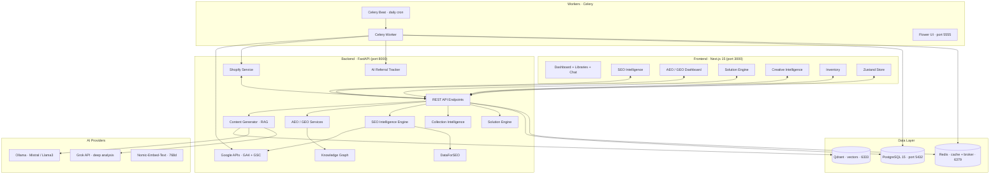

# RAG SEO Engine

An AI-powered **SEO / AEO / GEO** platform for Shopify catalogs. It generates product content with a retrieval-augmented (RAG) pipeline, then ties every change to **measurable organic impact** — not just SEO-score movement. It was built end to end for a ~5,000-SKU automotive transmission-parts retailer, but the pipelines are domain-agnostic — keep the structure and adapt it to your own industry.

> **Portfolio note.** This is a sanitized public snapshot of a production system I designed and built end to end for a Mexican automotive transmission-parts retailer (selling on Shopify, Mercado Libre and B2B). Secrets, credentials, brand identifiers and real business data have been removed — all configuration uses placeholders (`backend/.env.example`) and it runs against your own store, catalog and industry.

## What I built

Solo, end to end: the system architecture, the **FastAPI** backend, the **Next.js 15** dashboards, the RAG / AEO / GEO content pipelines, and the **Shopify · GA4 · Search Console · DataForSEO** integrations — fully containerized with Docker Compose.

## Architecture



## Key features

- **SEO Intelligence** — traffic-weighted before/after analytics per product, anchored to the content-edit timestamp. A Real-Impact score (impressions / clicks / position) with **overlap detection**: if price or inventory also changed in the same window, the verdict downgrades to *inconclusive* — so a stockout-driven dip is never mistaken for a bad title edit.
- **RAG content generation** — the LLM reads the relevant technical documents (organized by **brand / product type / transmission**) before writing Spanish-first content. High-performing titles & URLs are guardrailed.
- **AEO / GEO layer** — `llms.txt` generator, a fault-code **knowledge graph** (P0700 → recommended SKUs), JSON-LD (`VehiclePart` / `FAQPage` / `HowTo`) via Shopify metafields, and AI-referral order attribution (ChatGPT / Claude / Perplexity).
- **Collection Intelligence** — keyword-cannibalization guard between blog posts and collections, plus multi-agent structure recommendations.
- **Solution Engine** — symptom / fault-code → ranked parts + a structured diagnostic path.
- **Shopify integration** — two-way product & metafield sync, automatic 301 redirects on handle changes, incremental order sync via `order_line_items`.

## Adapting it to your own catalog

It was built for an automotive transmission-parts store, but nothing about the **pipelines** is automotive-specific — RAG content generation, SEO-impact scoring, the AEO/GEO layer, Shopify sync and analytics all work for any product catalog. To retarget it to another store or industry you keep the structure and change four things, no core-code edits:

1. **Store profile** — set `STORE_NAME`, `STORE_URL`, contact and brand fields in `backend/.env` (and `NEXT_PUBLIC_STORE_*` for the dashboard). Storefront URLs, schema.org identity and brand-mention detection all derive from these.
2. **Knowledge base** — re-seed the RAG libraries with your own product / technical documents (the LLM only writes from what it can retrieve).
3. **Brand voice** — adjust the system prompts to your tone, language and policies.
4. **Domain taxonomy** — swap the automotive specifics (transmission fault codes, `VehiclePart` schema, product types) for your vertical's categories and JSON-LD types.

Single-tenant by design: one configured instance per store.

## Tech stack

- **Frontend** — Next.js 15 · React 18 · TypeScript · Tailwind · Zustand · Recharts
- **Backend** — FastAPI · SQLAlchemy · Pydantic · Python 3.12
- **Data** — PostgreSQL 15 · Qdrant (vectors) · Redis
- **Async** — Celery + Beat + Flower
- **AI** — Ollama (local) · Grok · Nomic-Embed-Text (768d) · multi-provider LLM abstraction
- **Infra** — Docker / Docker Compose

→ Full technical breakdown in **`STACK.md`** · local setup & troubleshooting in **`SETUP.md`**.

## Quick start

```bash
cp backend/.env.example backend/.env    # fill in your own keys
docker compose up -d                    # postgres · redis · qdrant · backend · frontend · celery
```

- Frontend → http://localhost:3000
- API docs (Swagger) → http://localhost:8000/docs

## Engineering decisions worth noting

- **Impact over vanity metrics** — an edit's verdict requires a real traffic signal and is voided if Shopify state changed in the same window.
- **Guardrails** — products with >1,000 monthly impressions are never auto-retitled; Shopify auto-redirects make every change reversible.
- **Multi-provider LLM abstraction** — Ollama for cheap/local generation, Grok for deep analysis; switch with one env var.
- **Cost control** — DataForSEO gated behind an impressions floor and an async endpoint mode (~10× cheaper) for batch jobs.

---

Designed and built end to end by **Théo Daudebourg**.
